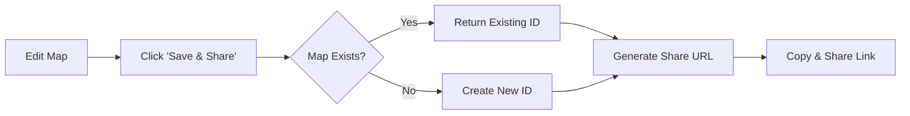
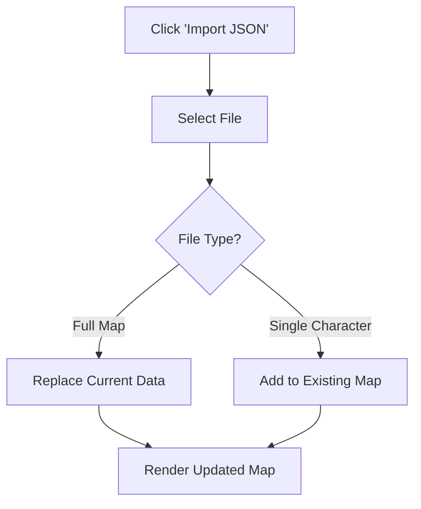
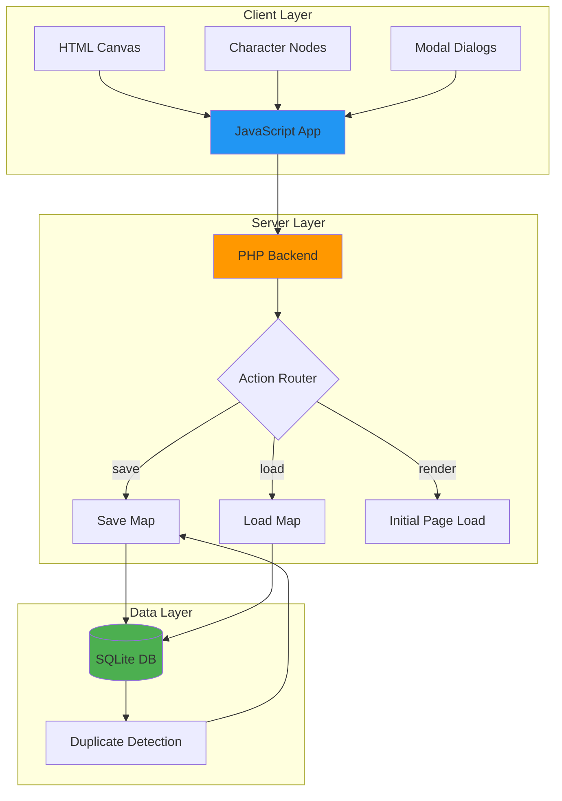

# xsukax Character Relationship Map

A self-hosted, privacy-focused web application for creating, visualizing, and managing character relationship maps. Perfect for writers, game masters, storytellers, and anyone working with complex character networks who needs to map relationships, hierarchies, and connections in an intuitive visual format.


## 🎯 Project Overview

xsukax Character Relationship Map is a lightweight, single-file PHP application that enables users to create interactive visual maps of character relationships. The application provides an intuitive drag-and-drop interface where characters can be positioned freely on a canvas, connected with labeled relationships, and organized into meaningful networks. Built on a SQLite backend, it offers persistent storage with intelligent duplicate detection, ensuring efficient database utilization without compromising functionality.

The tool is designed for creative professionals who need to visualize complex character dynamics in novels, tabletop RPGs, screenplays, video games, or any narrative medium. With features like photo uploads, relationship typing, export capabilities, and shareable links, it serves as both a planning tool and a reference system throughout the creative process.

## 🔒 Security and Privacy Benefits

This application prioritizes user privacy and data security through several architectural decisions:

- **Self-Hosted Architecture**: All data remains on your server—no third-party cloud services, external APIs, or data transmission to external entities. You maintain complete ownership and control over your character data.

- **No User Tracking**: The application contains no analytics, tracking scripts, or telemetry. User interactions are not monitored, logged, or shared with any external parties.

- **Local Database Storage**: Utilizes SQLite for data persistence, storing all information in a local file on your server. This eliminates dependencies on external database services and reduces attack surface area.

- **No Authentication Required**: Designed for single-user or trusted-environment deployment, eliminating the complexity and potential vulnerabilities associated with authentication systems. For multi-user scenarios, standard web server authentication can be implemented at the infrastructure level.

- **Optimized Image Storage**: Images are automatically resized to a maximum height of 200 pixels and compressed to JPEG format at 80% quality, reducing storage requirements while preventing potential DoS attacks through oversized uploads.

- **Server-Side Validation**: All data operations are validated server-side through prepared SQL statements, protecting against SQL injection attacks and ensuring data integrity.

- **Minimal Attack Surface**: Single-file deployment with no external dependencies beyond PHP and SQLite reduces the potential for supply chain attacks or vulnerable third-party libraries.

- **Smart Duplicate Prevention**: The system automatically detects identical maps and reuses existing database IDs, preventing database bloat while maintaining efficient operation even with repeated save operations.

## ✨ Features and Advantages

### Core Functionality
- **Visual Character Management**: Create characters with photos, names, roles, and detailed descriptions in an intuitive modal interface
- **Relationship Mapping**: Define directional relationships between characters with custom types and descriptions
- **Interactive Canvas**: Zoom, pan, and navigate large relationship networks with smooth mouse wheel controls and drag gestures
- **Drag-and-Drop Positioning**: Freely position characters anywhere on the canvas with real-time visual feedback
- **Connection Mode**: Shift+Click workflow for rapid relationship creation between characters

### Data Management
- **Save and Share**: Generate unique, shareable URLs for your character maps with intelligent duplicate detection
- **JSON Export/Import**: Export entire maps or individual characters for backup, version control, or collaboration
- **PNG Export**: Generate high-resolution (3x scale) publication-ready images of your relationship maps
- **Character-Level Export**: Export individual characters with their associated relationships for modular management

### User Experience
- **Bidirectional Text Support**: Full support for RTL languages with automatic text direction detection
- **Keyboard Shortcuts**: Escape to cancel connections, Shift+Click for quick relationship creation
- **Visual Feedback**: Color-coded states (selected, connecting, hovering) provide clear interaction cues
- **Responsive Design**: Clean, GitHub-inspired dark theme optimized for extended use
- **Connection Labels**: Inline relationship type labels positioned at relationship midpoints for clarity

### Technical Advantages
- **Single-File Deployment**: Entire application in one PHP file—no build process, no dependency management
- **Zero Configuration**: Works out-of-the-box with default PHP and SQLite installations
- **Lightweight**: Minimal server requirements enable deployment on shared hosting or resource-constrained environments
- **Database Efficiency**: Automatic deduplication prevents storage waste when saving identical maps
- **Cross-Platform**: Runs on any platform supporting PHP 7.4+ (Linux, Windows, macOS)

## 📋 Installation Instructions

### Prerequisites

Before installation, ensure your server meets these requirements:

- PHP 7.4 or higher with SQLite3 extension enabled
- Web server (Apache, Nginx, or similar)
- Write permissions for the application directory (for SQLite database creation)

### Installation Steps

1. **Download the Application**
   ```bash
   # Clone the repository
   git clone https://github.com/xsukax/xsukax-Character-Relationship-Map.git
   
   # Or download directly
   wget https://github.com/xsukax/xsukax-Character-Relationship-Map/archive/main.zip
   unzip main.zip
   ```

2. **Configure Web Server**

   **For Apache:**
   ```apache
   # .htaccess (if not already configured)
   <IfModule mod_rewrite.c>
       RewriteEngine On
       RewriteBase /
   </IfModule>
   ```

   **For Nginx:**
   ```nginx
   server {
       listen 80;
       server_name your-domain.com;
       root /path/to/xsukax-Character-Relationship-Map;
       index index.php;

       location / {
           try_files $uri $uri/ /index.php?$query_string;
       }

       location ~ \.php$ {
           fastcgi_pass unix:/var/run/php/php-fpm.sock;
           fastcgi_index index.php;
           include fastcgi_params;
           fastcgi_param SCRIPT_FILENAME $document_root$fastcgi_script_name;
       }
   }
   ```

3. **Set Directory Permissions**
   ```bash
   # Ensure the web server can write to the directory
   chmod 755 /path/to/xsukax-Character-Relationship-Map
   chown www-data:www-data /path/to/xsukax-Character-Relationship-Map
   ```

4. **Verify Installation**
   
   Navigate to your installation URL (e.g., `http://localhost/index.php` or `http://your-domain.com`). The application should load with an empty character map and sidebar controls.

5. **Database Initialization**
   
   The SQLite database (`map.db`) will be automatically created on first use. No manual database setup is required.

### Troubleshooting

- **"SQLite3 extension not found"**: Enable the SQLite3 extension in your `php.ini` file
- **Database write errors**: Verify directory permissions allow the web server to create and write files
- **Blank page**: Check PHP error logs (`error_log`) for detailed error messages

## 📖 Usage Guide

### Getting Started

#### Creating Your First Character

1. Click the **"+ Add Character"** button in the left sidebar
2. Fill in character details:
   - **Photo** (optional): Upload an image that will be automatically resized
   - **Name** (required): Character's full name
   - **Role** (optional): Character's function (e.g., "Protagonist", "Antagonist")
   - **Description** (optional): Additional context or notes
3. Click **"Save"** to add the character to your map

Characters appear as cards on the canvas with circular photo avatars (or initials if no photo is provided).

#### Positioning Characters

- **Drag characters** anywhere on the canvas by clicking and holding
- **Zoom** using the mouse wheel to adjust view scale (25% to 300%)
- **Pan** by clicking and dragging on the empty canvas background
- Click **"Reset View"** in the toolbar to return to default zoom and position

#### Creating Relationships

1. Hold **Shift** and click on the first character (source)
2. The character will highlight in orange, and a connection hint will appear
3. Click on the second character (target) to open the relationship dialog
4. Enter relationship details:
   - **Relationship Type** (required): e.g., "Friend", "Enemy", "Family", "Mentor"
   - **Description** (optional): Additional context about the relationship
5. Click **"Save"** to create the directional connection

Relationships appear as arrows with labeled midpoints indicating the relationship type.

#### Editing and Management

- **Edit Character**: Double-click any character card or select it from the sidebar list
- **Edit Relationship**: Click directly on a relationship line or its label
- **Delete Character**: Select a character and click **"Delete Selected"** in the toolbar
- **Delete Relationship**: Open the relationship editor and click **"Delete"**

### Data Operations

#### Saving and Sharing



1. Click **"💾 Save & Share"** in the sidebar
2. The system checks if an identical map exists:
   - If found: Returns the existing URL (no duplicate created)
   - If new: Generates a unique 8-character ID
3. Copy the shareable URL and distribute to collaborators
4. Anyone with the URL can view the map (but cannot edit without server access)

#### Export Options

**Export Entire Map (JSON)**
```bash
# Click "Export JSON" to download complete map data
# File includes all characters and relationships
# Use for backups, version control, or data migration
```

**Export Single Character (JSON)**
```bash
# Open character editor → Click "Export"
# Exports character data plus connected relationships
# Useful for sharing individual character profiles
```

**Export as Image (PNG)**
```bash
# Click "Export as PNG" to generate high-res image
# 3x scaling ensures print-quality output
# Automatically crops to content boundaries with padding
```

#### Import Workflow



1. Click **"Import JSON"** in the sidebar
2. Select a previously exported JSON file
3. The system detects the file type:
   - **Full map**: Replaces all current data
   - **Single character**: Adds character to existing map with new ID
4. Imported data renders immediately on the canvas

### Keyboard Shortcuts

| Shortcut | Action |
|----------|--------|
| **Shift + Click** | Start/create relationship connection |
| **Escape** | Cancel active connection mode |
| **Double-Click** | Edit character properties |
| **Mouse Wheel** | Zoom in/out |
| **Click + Drag** (background) | Pan canvas |
| **Click + Drag** (character) | Move character position |

### Application Architecture



### Best Practices

- **Regular Exports**: Periodically export your maps as JSON for backup purposes
- **Descriptive Names**: Use clear, consistent naming conventions for characters and relationships
- **Relationship Types**: Establish a standard vocabulary for relationship types across your project
- **Visual Organization**: Group related characters spatially on the canvas for improved readability
- **Shareable Links**: Bookmark or save generated share URLs for quick access to specific map versions

## 📄 License

This project is licensed under the GNU General Public License v3.0.

---

**Repository**: [https://github.com/xsukax/xsukax-Character-Relationship-Map](https://github.com/xsukax/xsukax-Character-Relationship-Map)

**Issues & Contributions**: Please report bugs or submit feature requests via GitHub Issues. Pull requests are welcome for bug fixes and enhancements that align with the project's privacy-focused philosophy.
